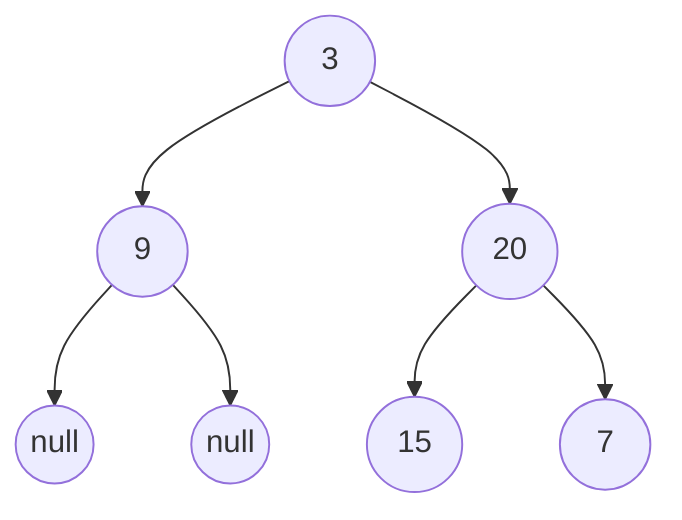

# A. Construct Binary Tree from Preorder and Inorder Traversal
time limit pre test: 1 second  
memory limit per test: 256 megabytes  

給予兩整數陣列 `preorder` 和 `inorder`，分別對應前敘走訪跟中敘走訪的順序，請將二元樹建立出來。

原題連結：[LeetCode[construct binary tree from preorder and inorder traversal]](https://leetcode.com/problems/construct-binary-tree-from-preorder-and-inorder-traversal/description/)

### Input
輸入共兩行，第一行有 $n$ 個整數為前敘走訪的結果，中間由空格隔開，而第二行則是中敘走訪同一棵樹的結果。
- $1 \le$ preorder.length $\le 3000$
- $-3000 \le$ preorder\[i\], inorder\[i\] $\le 3000$
- inorder 與 preorder 的長度相等。
- preorder 和 inorder 由不重複的整數所組成。
- 所有出現在 inorder 裡的整數皆會出現在 preorder 中。

### Output
輸出建立好的樹，若子樹為空，輸出`null`。

### Examples
Input
```plain
3 9 20 15 7
9 3 15 20 7
```

Output
```plain
3 9 20 null null 15 7
```
