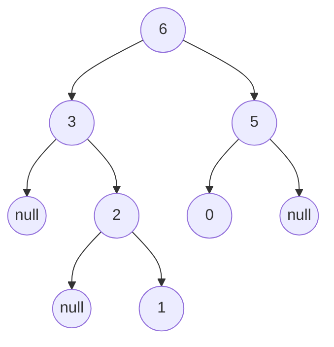

# B. Maximum Binary Tree
time limit pre test: 1 second  
memory limit per test: 256 megabytes  

給予一整數陣列`nums`，其中不包含重複項，請使用遞迴的規則建立「最大二元樹」。規則如下：
1. 建立根結點，其數值為當前陣列中的最大值
2. 使用最大值左方的子陣列，遞迴地建立左子樹。
3. 使用最大值右方的子陣列，遞迴地建立右子樹。

原題連結：[LeetCode[maximum binary tree]](https://leetcode.com/problems/maximum-binary-tree/)

### Input
輸入共一行，有$n$個數值為`nums`陣列的每個元素，中間由空格隔開。
- $1 \le$ nums.length $\le 1000$
- $0 \le$ nums[i] $\le 1000$
- 在nums中的整數不會重複

### Output
輸出建立好的樹，若子樹為空，輸出`null`。

### Examples
Input
```plain
3 2 1 6 0 5
```

Output
```plain
6 3 5 null 2 0 null null 1
```

